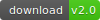
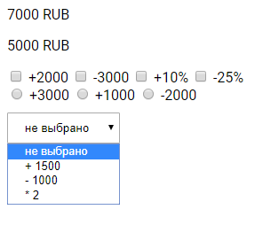

# PriceUpdater.js

 [][1]

### Description

Allows to update price in the page  
**It works without jquery.**

### How to use

**html:**  
Just add attribute **"data-priceupdater"** and use settings as **"data-"** attributes.  
You can define operator for calculate via **"data-operator"** attribute on options elements. 
```html
<p 
    data-priceupdater
    data-value="5000"
    data-currency=" RUB"
>5000 RUB</p>

<span>option 1 (+1000):</span>
<input type="checkbox" name="option_1" data-point data-operator="+" value="1000">

```
**JavaScript:**  
Create new price objects with special class.

```js
var price = new PriceUpdater({ target : "#main" });
```

### Settings

If you use javascript notation, than the first required setting is a **target**, wich must be css selector of the price element.

| setting      | attribute      | description                                          | default |
|:-------------|:---------------|:-----------------------------------------------------|:--------|
| value        | data-value     | value wich added to the price element                | 0       |
| currency     | data-currency  | used currency                                        | "$"     |
| space        | data-space     | space between price and currency                     | false   |
| template     | data-template  | html template for setuping output of value and currency | none    |
| points       | data-points    | indicate target options on the page                  | none    |
| oldPrice     | data-old-price | selector of the old-price element                    | false   |
| oldValue     | data-old-value | value of old price                                   | 0       |
| factor       | data-factor    | number wich define relation old-price/price          | 0       |
| animation    | data-animation | use animation of changing price                      | false   |
| duration     | data-duration  | duration of animation                                | 500     |
| onChange     | data-on-change | function invoked when price changed                  | none    |
| onReady      | data-on-ready  | function invoked when element is ready               | none    |
| onAnimUpdate | none           | function invoked when update keyframes of animation  | none    |

**Operators:**  

| sum | subtract | multiply | devide | plus percent | minus percent  |
|:---:|:--------:|:--------:|:------:|:------------:|:--------------:|
| \+  |    \-    |    \*    |    /   |      \+%     |       \-%      |


For using old-price necessarily define **oldValue** (first priority) or **factor** (second priority).  
oldValue defined as setting or it can be taken from text in the appropriate element.  
Also oldValue can be calced if you define the factor.  
  
For defining options - add empty **data-point** attribute for each option.  
If you want use more than one price on the page - define **points** setting to the price and use this value as **data-target** for each options.  

```html
<!-- first price -->
<p
    data-priceupdater
    data-points="price_1"
    data-value="5000"
>5000 RUB</p>

<!-- other price -->
<p data-priceupdater data-value="2000"></p>

<!-- option for first price -->
<span>option 1:</span>
<input type="checkbox" name="option_1" data-target="price_1" data-operator="+" value="1000">

<!-- other options -->
```

Using select element:
```html
<span>option 1:</span>
<select name="option_1" data-point >
    <option>не выбрано</option>
    <option data-operator="+" value="1500">option 1.1</option>
    <option data-operator="/" value="1000">option 1.2</option>
    <option data-operator="*" value="2">option 1.3</option>
</select>
```

Using radio elements:
```html
<span>option 1:</span>
<input type="radio" name="option_1" data-point data-operator="+%" value="10">
<input type="radio" name="option_1" data-point data-operator="+%" value="15">
<input type="radio" name="option_1" data-point data-operator="+%" value="20">
```

Also you can use html template for setuping output of prices.
It supports two variables - **{value}** and **{currency}**.
```html
<p
    data-priceupdater
    data-value="5000"
    data-currency="RUB"
    data-template="<b>{value}</b> {currency}"
></p>
```

### API

**Common:**

- isPriceUpdater - *true*
- **static getById** (id)

Via static method **getById** you can get instance from all price elements on the page include elements created with "data-priceupdater" attributes.

```js
// "main" is id of the price element
var price = PriceUpdater.getById("main");
```

**For instance:**

- isPrice - *true*
- **attachOption** (element, operator)

If you want add new element you can create him with native way and after attach via **attachOption** method to the price.

```js
var price = new PriceUpdater({
        target   : "#main",
        value    : 5000,
        currency : "RUB",
        template : "<b>{value}</b> {currency}",
        oldPrice : "#old",
        factor   : 1.5
    });

var checkBox = document.createElement("input");
    checkBox.type  = "checkbox";
    checkBox.name  = "new";
    checkBox.value = 1000;

document.body.appendChild(checkBox);

if (price.isPrice)
    price.attachOption(checkBox, "+");
```

### Result



-------------
Thank's for using.  
Developed by Ustinov Maxim - ewclide

[1]: https://github.com/ewclide/priceupdater/archive/v2.0.zip  "download"